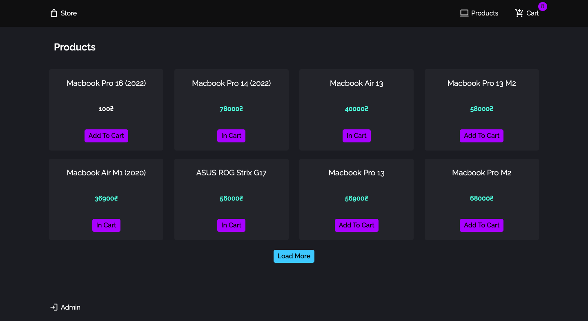
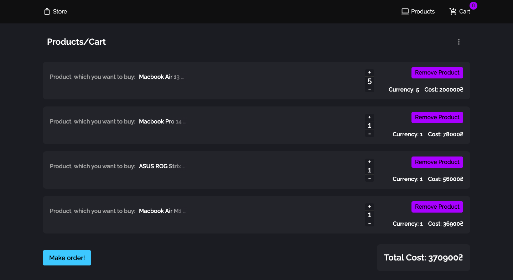
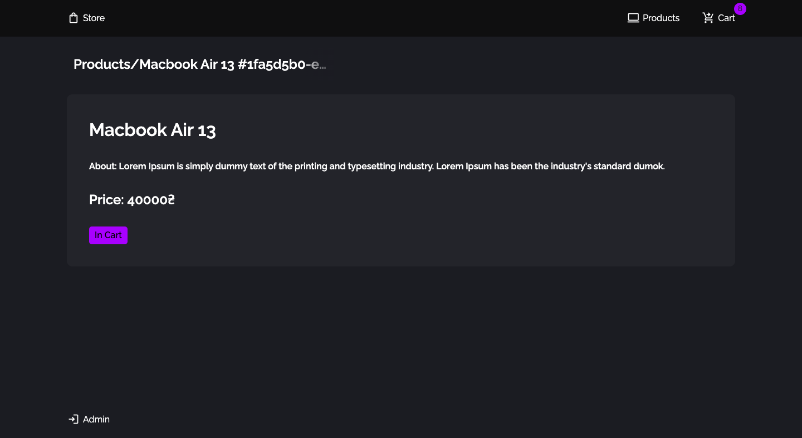
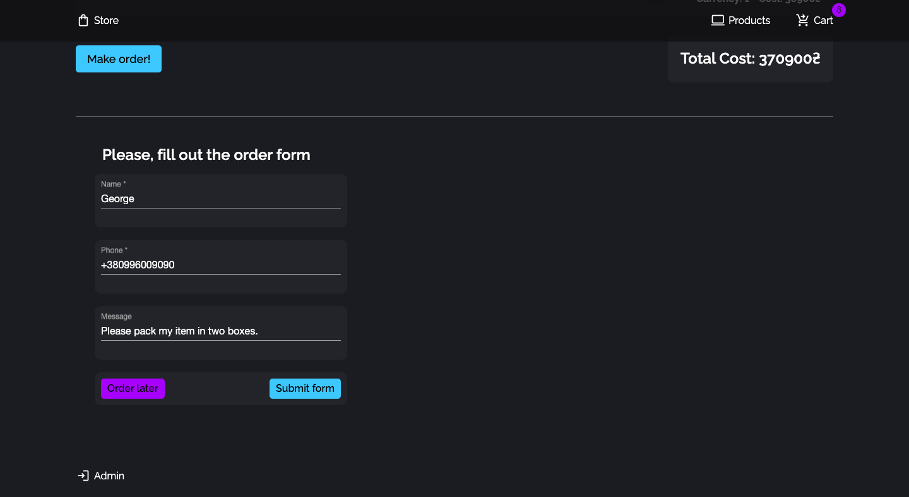
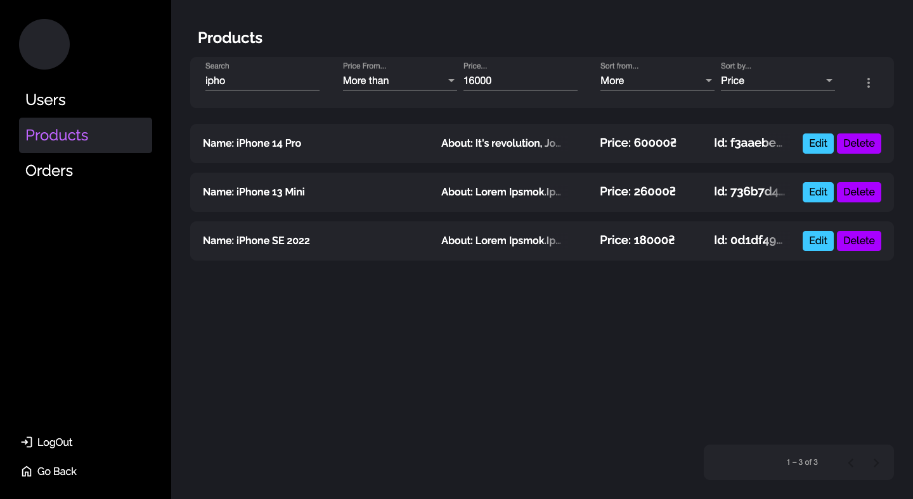

# HYS Angular Store

<!-- <div align="center">
  <a href="https://github.com/othneildrew/Best-README-Template">
    
  </a>

  <h3 align="center">Online Store</h3>
</div>  -->

## Get Started

If you want to see the project without deploying it locally, you can follow this link to GitHub Pages: https://georgedeyneka.github.io/HYS_StoreAngular/

So, if you want to look at the project's code and deploy it, follow the steps below in the "Installation" section.

### Installation

1. Clone the repo
```sh
git clone https://github.com/GeorgeDeyneka/HYS_StoreAngular.git
```
2. Install NPM packages
```sh
npm install
```
3. Run this command for a dev server. Navigate to `http://localhost:4200/`. The application will automatically reload if you change any of the source files.
```sh
ng serve -o
```

## About project

This is my pet project, written during the training course from HYS Enterprise. It is an online store where you can view products, add them to your cart, and create an order.

However, if you have administrator rights and are logged in, you can filter or sort products, users, and orders using the filter bar. You also have the ability to interact with the server and perform CRUD operations.

Future plans include developing my own API and adding the ability to upload images, as well as adding more detailed product information.


### Built With

- [![Angular][Angular.io]][Angular-url]
- 
- 
- 
- 
- 
- 
- 


<!-- USAGE EXAMPLES -->
## Usage

### Main Page
<div>
  <ul>
    <li>
First of all, when you go from the start page by clicking the "Go Shopping!" you are taken to the main page. This is a product catalog. By clicking on the "Load More" button, you can additionally load products.
    </li>
    </br>
    <li>
By clicking on the "Add to Cart" buttons, you can add products to the cart and see in the modal window (you can hover over the "Cart" link at the top of the page). Clicking on the link will redirect you to the shopping cart page.
    </li>
  </ul>
  </br>

</div>

</br>

---

### Cart Page
<div>
  <ul>
    <li>
Once on the shopping cart page, you can change the number of products or delete product categories altogether.
    </li>
    </br>
    <li>
Also, you can empty the trash completely. At the bottom is the "Make Order" button and the total amount of your order.
    </li>
    </br>
    <li>
      You can also click on the product name to find out information about it.
    </li>
  </ul>
  </br>

</div>

</br>

---

### About Page
<div>
  <ul>
    <li>
When you click on the product name, you go to the "About" page. Here you can see the description and information about the product, as well as add it to the cart.
    </li>
    </br>
    <li>
By the way, you can view product information from any page by simply clicking on its name.
    </li>
  </ul>
  </br>

</div>

</br>

---

### Order Page
<div>
  <ul>
    <li>
You can fill out the form, and when you click the "Submit Form" button, your order will be generated, and all your items from the basket will fall into it.
    </li>
    </br>
    <li>
After placing an order, you will see a modal window stating that your order has been formed. Your shopping cart will be cleared automatically.
    </li>
    </br>
    <li>
If you filled out the form, but do not want to place an order right now, you can click on the "Order Later" button and your data will be stored in memory. Therefore, the form, however, your data will still be stored in it for future checkout.
    </li>
  </ul>
  </br>

</div>

</br>

---

### Admin Page
<div>
  <ul>
    <li>
If you click on the "Login" button at the bottom of the page, you will be redirected to the login page. In order to get to the administration page, you need to know your username and password.
    </li>
    </br>
    <li>
When you get to this page, you will be presented with several sections:
Users, Products and Orders.
    </li>
    </br>
    <li>
Before you will be an interface in the form of a table with information about products, as well as a panel for filtering objects.
    </li>
    </br>
    <li>
So, you can search and filter objects by different categories: it can be a name, id, price or other parameters. It all works in conjunction with each other so that you don't run into the problem of knocking down your filter when choosing a different filter parameter.
    </li>
  </ul>
  </br>

</div>

</br>


## Contributing

Contributions are what make the open source community such an amazing place to learn, inspire, and create. Any contributions you make are **greatly appreciated**.

If you have a suggestion that would make this better, please fork the repo and create a pull request. You can also simply open an issue with the tag "enhancement".

If you want to improve the project code, you need to:

1. Fork the Project
2. Create your Feature Branch (`git checkout -b feature/AmazingFeature`)
3. Commit your Changes (`git commit -m 'Add some AmazingFeature'`)
4. Push to the Branch (`git push origin feature/AmazingFeature`)
5. Open a Pull Request

Don't forget to give the project a star! Thanks again!


## My Contacts (Links)

- <a href="https://www.linkedin.com/in/george-deyneka-910003238/">
    
  </a> 
- <a href="https://t.me/Deyneka_George">
    
  </a> 
- <a href="mailto: zhoradeynecka@gmail.com">
    
  </a> 


## Acknowledgments

I'd like to thank to @Bormash1991 for helping me improve the project and help write the functionality.

I would also like to say thanks to @alexsednev for regular code reviews and advice on keeping the code structure correct.
 
[product-screenshot]: images/screenshot.png
[Next.js]: https://img.shields.io/badge/next.js-000000?style=for-the-badge&logo=nextdotjs&logoColor=white
[Next-url]: https://nextjs.org/
[Angular.io]: https://img.shields.io/badge/Angular-DD0031?style=for-the-badge&logo=angular&logoColor=white
[Angular-url]: https://angular.io/
